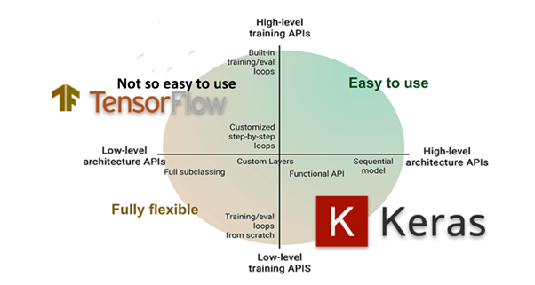

# Instructions

## Setup

Setting up python environment in macOS using Homebrew, Pyenv, and Pipenv [Link](https://gist.github.com/MFarooqRajput/3aaa63b24db2d5453a523bf342f02127)

Install Jupyter Notebook [Link](https://jupyter-tutorial.readthedocs.io/en/stable/first-steps/install.html)

## Commands

`pipenv install -r ./requirements.txt`

`pipenv run jupyter notebook`

## TensorFlow vs Keras

TensorFlow is an open-source set of libraries for creating and working with neural networks, such as those used in Machine Learning (ML) and Deep Learning projects. 

Keras, on the other hand, is a high-level API that runs on top of TensorFlow. Keras simplifies the implementation of complex neural networks with its easy to use framework.

[Keras](https://keras.io/)

[TF.Keras](https://www.tensorflow.org/api_docs/python/tf/keras)

[Keras.EfficientNet](https://keras.io/api/applications/)

[TF.Keras.EfficientNet](https://www.tensorflow.org/api_docs/python/tf/keras/applications)

[EfficientNet](https://towardsdatascience.com/complete-architectural-details-of-all-efficientnet-models-5fd5b736142)

## Jupyter Notebook

1. Explore the pith detection model **PithDetectionModelExplore**
